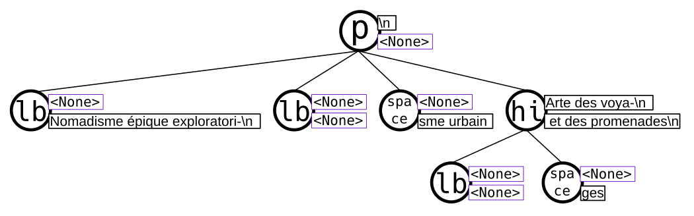
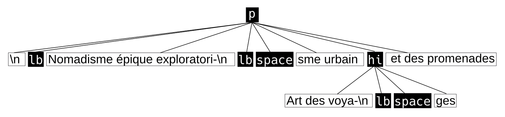

Design
======

tl;dr
-----

lxml resp. libxml2 are powerful tools, but have an unergonomic data model to
work with encoded text. Let's build a DOM API inspired wrapper around it.

Aspects & Caveats
-----------------

The library is partly opinionated to encourage good practices and to be more
pythonic_. Therefore its behaviour deviates from lxml and ignores stuff:

- Serializations of documents are UTF-8 encoded by default and always start
  with an XML declaration.
- Comment, CDATA and Processing Instruction nodes are not accessible (for now),
  but are retained and appear in serializations; unless you **[DANGER ZONE]**
  manipulate the tree (and you want that often). Depending on your actions you
  might encounter no alterations or a complete loss of these nodes within the
  root node.
  As the implementation will evolve for a while, there are no recommendations
  to last. **[/DANGER ZONE]** It is *guaranteed*, however, that processing
  instructions and comments that appear before the root node in the stream are
  always persist for a :class:`Document` instance and its clones.

If you need to apply bad practices anyway, you can fall back to tinker with the
lxml objects that are bound to :attr:`TagNode._etree_obj`.

.. _pythonic: https://zen-of-python.info/there-should-be-one-and-preferably-only-one-obvious-way-to-do-it.html#13

Reasoning
---------

XML can be used to encode text documents, examples for such uses would be the
`Open Document Format`_ and XML-TEI_. It's more prevalent use however is to
encode data that is to be consumed by algorithms as configuration, measurements,
application events, various metadata and so on.

Python is a high-level, general programming language with a vast ecosystem,
notably including diverse scientific communities and tools. As such it is well
suited to solve and cause problems in the humanities related field of Research
Software Engineering by programmers with different educational background and
expertise.

The commonly used Python library to parse and interact with a representation
of an XML document is lxml_. Other libraries like the
:mod:`xml.etree.ElementTree` module from the Python standard library shall not
be discussed due to their insignificance and shortcomings. It is notable that at
least these two share significant design aspects of Java APIs which is perceived
as weird and clumsy in Python code.
lxml is a wrapper around libxml2_ which was developed by the GNOME_ developers
for other data than text documents. Data that is strictly structured and
expectable. Text documents are different in these regards as the encoding mixes
different abstracted encapsulations of logical and physical text fragments. And
they are formulated and structured for human consumers, and often printing
devices.

So, what's wrong with lxml? Not much, it's a rock-solid, fast API for XML
documents with known issues and known workarounds that represents the full glory
of what a full-fledged specification implies - of which a lot is not of concern
for the problems at hand and occasionally make solutions complicated. The one
aspect that's very wrong in the context of text processing is unfortunately its
central model of elements and data/text. In particular the notion of an element
*tail* makes the whole enchilada tricky to traverse / navigate. The existence
of this attribute is due to the insignificance of these fragments of an XML
stream in the aforementioned, common uses of XML. Now it is time for an example,
given this document snippet:

.. code-block:: xml

  

    <lb/>Nomadisme épique exploratori-
    <lb/><space dim="horizontal" quantity="2" units="chars"/>sme urbain <hi rendition="#b">Art des voya-
    <lb/><space dim="horizontal" quantity="2" units="chars"/>ges</hi> et des promenades
  

Here's a graphical representation of the markup with etree's elements and their
text and tail attributes:

When thinking about a paragraph of text, a way to conceptualize it is as a
sequence of sentences, formed by a series of words, a sequence of graphemes,
and punctuation. That's a quite simple cascade of categories which can be very
well anticipated when processing text. With that mental model, line beginnings
would rather be considered to be on the same level as signs, but "Nomadisme …"
turns out *not* to be a sibling object of the object that represents the line
beginning and is *not* in direct relation with the paragraph. In lxml's model it
is rather an attribute ``tail`` assigned to that line beginning. The structure
of the object that represents the ``hi`` element gives a good impression how
hairy simple tasks can become.

An algorithm that shall remove line beginnings, space representations and
concatenate broken words would need a function that removes the element objects
in question while preserving the text fragments in its meaningful sequence
attached to the ``text`` and ``tail`` properties. In case these have no content,
their value of ``None`` leads to different operations to concatenate strings.
Here's a working implementation from the inxs_ library that is used by a variety
of more specific functions:

.. code-block:: python

   def remove_elements(*elements: etree.ElementBase, keep_children=False,
                       preserve_text=False,
                       preserve_tail=False) -> None:
       """ Removes the given elements from its tree. Unless ``keep_children`` is
           passed as ``True``, its children vanish with it into void. If
           ``preserve_text`` is ``True``, the text and tail of a deleted element
           will be preserved either in its left sibling's tail or its parent's
           text. """
       for element in elements:
           if preserve_text and element.text:
               previous = element.getprevious()
               if previous is None:

                   parent = element.getparent()
                   if parent.text is None:
                       parent.text = ''
                   parent.text += element.text
               else:
                   if previous.tail is None:
                       previous.tail = element.text
                   else:
                       previous.tail += element.text

           if preserve_tail and element.tail:
               if keep_children and len(element):
                   if element[-1].tail:
                       element[-1].tail += element.tail
                   else:
                       element[-1].tail = element.tail
               else:
                   previous = element.getprevious()
                   if previous is None:
                       parent = element.getparent()
                       if parent.text is None:
                           parent.text = ''
                       parent.text += element.tail
                   else:
                       if len(element):
                           if element[-1].tail is None:
                               element[-1].tail = element.tail
                           else:
                               element[-1].tail += element.tail
                       else:
                           if previous.tail is None:
                               previous.tail = ''
                           previous.tail += element.tail

           if keep_children:
               for child in element:
                   element.addprevious(child)
           element.getparent().remove(element)

That by itself is enough to simply remove the ``space`` elements, but also
considering word-breaking dashes to wrap everything up is a similar piece of
routine of its own. And these quirks come back to you steadily while actual
markup is regularly more complex.

Now obviously, the data model that lxml / libxml2 provides is not up to standard
Python ergonomics to solve text encoding problems at hand.

There must be a better way.

There is a notable other markup parser that wraps around lxml, BeautifulSoup4_.
It carries some interesting ideas, but is overall too opinionated and partly
ambiguous to implement a stringent data model. A notable specification of a
solid model for text documents is the `DOM API`_ that is even implemented in the
standard library's :mod:`xml.dom.minidom` module. But it lacks an XPath
interface and rumours say it's slow. To illustrate the more accessible model
with a better locatability, here's another graphical representation of the
markup example from above with two different types of nodes:

Note that text containing attributes appear in document order which promises
an eased lookaround.
So, the obvious (?) idea is to wrap lxml in a layer that takes the DOM API as
paradigmatic inspiration, looks and behaves pythonic while keeping the wrapped
powers accessible.

(Now with that API at hand, this is what an equivalent of the horribly
complicated function would look like:

.. code-block:: python

   def remove_nodes(*nodes: NodeBase, keep_children=False):
       """ Removes the given elements from its tree. Unless ``keep_children`` is
            passed as ``True``, its children vanish with it into void. """

       for node in nodes:
          parent = node.parent
          index = node.index
          node.detach()
          if keep_children:
              parent.insert_node(
                  index,
                  *tuple(x.detach() for x in node.child_nodes())
              )

.. _BeautifulSoup4: https://www.crummy.com/software/BeautifulSoup/
.. _dom api: https://developer.mozilla.org/en-US/docs/Web/API/Document_Object_Model
.. _gnome: https://www.gnome.org/
.. _inxs: http://inxs.readthedocs.org/
.. _libxml2: http://xmlsoft.org/
.. _lxml: http://lxml.de/
.. _open document format: http://opendocumentformat.org/
.. _xml-tei: http://tei-c.org
