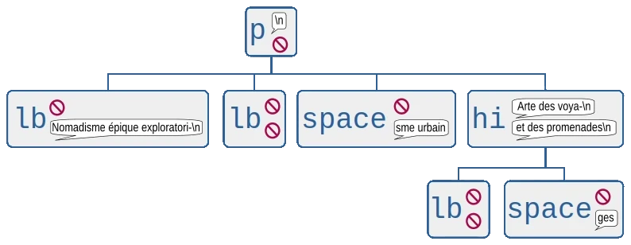
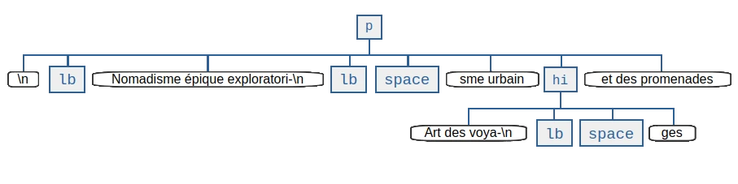

About the design
================

*delb* facilitates a Python API to handle XML encoded text documents with
ease(d pain).

The project started out as a wrapper around lxml_ in order to develop
experimental interfaces that can be used without starting a sufficient
implementation of XML related standards from scratch.
With version 0.6 all internal data keeping is fully implemented without
dependencies on other libraries.
The following sections document the initial motivation to investigate the design
of an interface to handle the particular data type for Python.

Reasoning
---------

XML can be used to encode text documents, examples for such uses would be the
`Open Document Format`_ and XML-TEI_.  It's more prevalent use however is to
encode data that is to be consumed by algorithms as configuration, measurements,
application events, various metadata and so on.

Python is a high-level, general programming language with a vast ecosystem,
notably including diverse scientific communities and tools.  As such it is well
suited to solve and cause problems in the humanities related field of Research
Software Engineering by programmers with diverse educational backgrounds and
expertises.

The commonly used Python library to parse and interact with a representation
of an XML document is lxml_.  Other libraries like the
:mod:`xml.etree.ElementTree` module from the Python standard library shall not
be discussed due to their insignificance and shortcomings.  It is notable that
at least these two share significant design aspects of Java APIs which is
perceived as weird and clumsy in Python code.
lxml is a wrapper around libxml2_ which was developed by the GNOME_ developers
for other data than text documents.  Data that is strictly structured and
expectable.  Text documents are different in these regards as natural languages
and variety of media allow and lead to unprecedented manifestations for which an
encoding mixes different abstracted encapsulations of text fragments.  And they
are formulated and structured for human consumers, and often printing devices.

So, what's wrong with lxml?  Not much, it's a rock-solid, fast API for XML
documents with known issues and known workarounds that represents the full glory
of what a full-fledged family of specification implies -- of which a lot is not
of concern for the problems at hand and occasionally make solutions complicated.
The one aspect that's very wrong in the context of text processing is
unfortunately its central model of elements and data/text that is attached to it
in two different relations.  In particular the notion of an element *tail* makes
the whole enchilada tricky to traverse / navigate.  The existence of this
attribute is due to the insignificance of these fragments of an XML stream in
the aforementioned, common uses of XML.

Now it is time for an example, given this document snippet:

.. code-block:: xml

  

    <lb/>Nomadisme épique exploratori-
    <lb/><space dim="horizontal" quantity="2" units="chars"/>
         sme urbain <hi rendition="#b">Art des voya-
    <lb/><space dim="horizontal" quantity="2" units="chars"/>
         ges</hi> et des promenades
  

Here's a graphical representation of the markup with etree's elements and their
text and tail attributes.  ``text`` attributes appear to the right of a tag name
on top, ``tail`` below that, 🚫 signify a :obj:`None` value which is
semantically equivalent to an empty :class:`str`, but needs to be handled very
differently:

When thinking about a paragraph of text, one way to conceptualize it is as a
sequence of sentences, formed by a series of words, a sequence of graphemes,
and punctuation.  That's a quite simple cascade of categories which can be very
well anticipated when processing text.  With that mental model, line beginnings
would rather be considered to be on the same level as signs, but "Nomadisme …"
turns out *not* to be a sibling object of the object that represents the line
beginning and is *not* in direct relation with the paragraph.  In lxml's model
it is rather an attribute ``tail`` assigned to that line beginning.  The text
contents of the object that represents the ``hi`` element and its children give
a good impression how hairy simple tasks can become.  Also notable is the
presence of a newline character (``\n``) from the parsed data stream that is
actually insignificant.

An algorithm that shall remove line beginnings (``lb``) as well as space
representations (``space``) and concatenate broken words would need a function
that removes the element objects in question while preserving the text fragments
in its meaningful sequence attached to the ``text`` and ``tail`` properties of
tag elements.  In case these have no content, their value of ``None`` requires
other operations to concatenate strings.  Here's a working implementation from
the inxs_ library [#fn-inxs]_ for that data model:

.. dropdown:: A complete implementation to solve a simple problem
   :open:

   .. code-block:: python

       def remove_elements(
           *elements: etree.ElementBase,
           keep_children=False,
           preserve_text=False,
           preserve_tail=False
       ) -> None:
           """ Removes the given elements from its tree. Unless ``keep_children`` is
               passed as ``True``, its children vanish with it into void. If
               ``preserve_text`` is ``True``, the text and tail of a deleted element
               will be preserved either in its left sibling's tail or its parent's
               text. """
           for element in elements:
               if preserve_text and element.text:
                   previous = element.getprevious()
                   if previous is None:
                       parent = element.getparent()
                       if parent.text is None:
                           parent.text = ''
                       parent.text += element.text
                   else:
                       if previous.tail is None:
                           previous.tail = element.text
                       else:
                           previous.tail += element.text

               if preserve_tail and element.tail:
                   if keep_children and len(element):
                       if element[-1].tail:
                           element[-1].tail += element.tail
                       else:
                           element[-1].tail = element.tail
                   else:
                       previous = element.getprevious()
                       if previous is None:
                           parent = element.getparent()
                           if parent.text is None:
                               parent.text = ''
                           parent.text += element.tail
                       else:
                           if len(element):
                               if element[-1].tail is None:
                                   element[-1].tail = element.tail
                               else:
                                   element[-1].tail += element.tail
                           else:
                               if previous.tail is None:
                                   previous.tail = ''
                               previous.tail += element.tail

               if keep_children:
                   for child in element:
                       element.addprevious(child)
               element.getparent().remove(element)

That by itself is enough to simply remove the representations of phenomena, but
also considering word-breaking dashes to wrap everything up is a similar piece
of routine of its own.  And these quirks come back to you steadily while actual
markup is regularly more complex.

Now obviously, the data model that *lxml* / *libxml2* provides is not up to
standard Python ergonomics to solve text encoding problems.

There must be a better way.

There is a notable other markup interface that wraps around lxml (among other
options), BeautifulSoup4_.  It carries some interesting ideas, but is overall
too opinionated and partly ambiguous to implement a stringent data model.  A
notable specification of a solid model for text documents is the `DOM API`_ that
is even implemented in the standard library's :mod:`xml.dom.minidom` module.
But this implementation lacks an XPath interface and rumours say it's slow.  To
illustrate the more accessible model with a better locatability, here's another
graphical representation of the markup example from above with text content in
an emancipated, dedicated node type:

Note that text containing nodes appear in document order which promises an eased
lookaround.  So, the obvious (?) idea is to wrap lxml in a layer that takes the
DOM API as paradigmatic inspiration, looks and behaves pythonic while keeping
the wrapped powers accessible.

Now with that API available, this is what an equivalent of the horribly
complicated function seen above would look like:

.. code-block:: python

   def remove_nodes(*nodes: XMLNodeType, keep_children=False):
       """ Removes the given nodes from its tree. Unless ``keep_children`` is
           passed as ``True``, its children vanish with it into void. """
       for node in nodes:
           node.detach(retain_child_nodes=keep_children)

Frequently Asked Questions
--------------------------

Isn't XML an obsolete format for text encoding, invented by boomers and
cynically held up by their Generation X apologists? Why don't you put your
efforts in developing new approaches such as storing text in a graph database?

   We think that XML-based encodings are actually very well suited for long-term
   usable text representations with a broad potential for granularity of
   capturing and semantic annotations. Not only is the data format simple enough
   to hold a full artifact in a self-contained file, but we also consider the
   duality of a format that can be handled both as stream and as tree as a
   helpful feature to address the physical and logical dimensions of a text and
   its manifestation. That is advantageous over depending on a heavy-weight
   database system.
   We acknowledge unquestionably that the specifications in the XML universe are
   often over-engineered, partly stuck in the times of their genesis and thus
   (euphemistically put) `no fun`_. As a direct result of that the availability
   of implementations for contemporary development contexts and their ergonomics
   are poor, if available at all for a platform. That is what *delb* is
   addressing.

What are your long-term goals with this project?

   After modeling that API as a wrapper around lxml_ the aim is now to replace
   it piece by piece with a Pure Python™ implementation that will later be
   transpiled to C extension code with mypyc_.

   Eventually we'd like to re-conquer the world wide web and make unagitated,
   long texts and Stooges clips its predominant content again. On that occasion,
   fuck you Mark, fuck off Jeff, go fuck yourself Peter and all the other
   fucknut character masks. What a disgusting misery it is that the capital
   created from Tim's ideas.

Interesting Resources
---------------------

- In a reflection on a text problem with XML from 2010, `Kurt Raschke`_ pointed
  out that "In a DOM-based implementation, it would be relatively easy …]" to
  solve, "[b]ut lxml doesn't use text nodes; instead it uses [text] and [tail]
  properties to hold text content."
- In his 2025 proposition of Ragnarok_ *Steve DeRose* formulates a similar
  critique of the state of the art regarding Python facilities for XML encoded
  text documents.
- `The Annotated XML Specification <https://www.xml.com/axml/axml.html>`_ by
  co-editor Tim Bray gives cultural, historical and technical insights from a
  text-processing programmer.
- The `Xml Sucks <http://wiki.c2.com/?XmlSucks>`_ page sheds light on the
  perspective of XML usage for non-text documents.

.. [#fn-inxs] The ``inxs`` library failed. Yet it made clear which layer in
              Python XML Text handling needs to be fixed.

.. _BeautifulSoup4: https://www.crummy.com/software/BeautifulSoup/
.. _dom api: https://developer.mozilla.org/en-US/docs/Web/API/Document_Object_Model
.. _gnome: https://www.gnome.org/
.. _inxs: http://inxs.readthedocs.org/
.. _libxml2: https://gitlab.gnome.org/GNOME/libxml2
.. _Kurt Raschke: https://web.archive.org/web/20190316214219/https://kurtraschke.com/2010/09/lxml-inserting-elements-in-text/
.. _lxml: https://lxml.de/
.. _mypyc: https://mypyc.readthedocs.io/
.. _no fun: https://www.youtube.com/watch?v=5sSKH0iXWo8
.. _open document format: https://opendocumentformat.org/
.. _Ragnarok: https://doi.org/10.4242/BalisageVol30.DeRose01
.. _xml-tei: https://tei-c.org/
